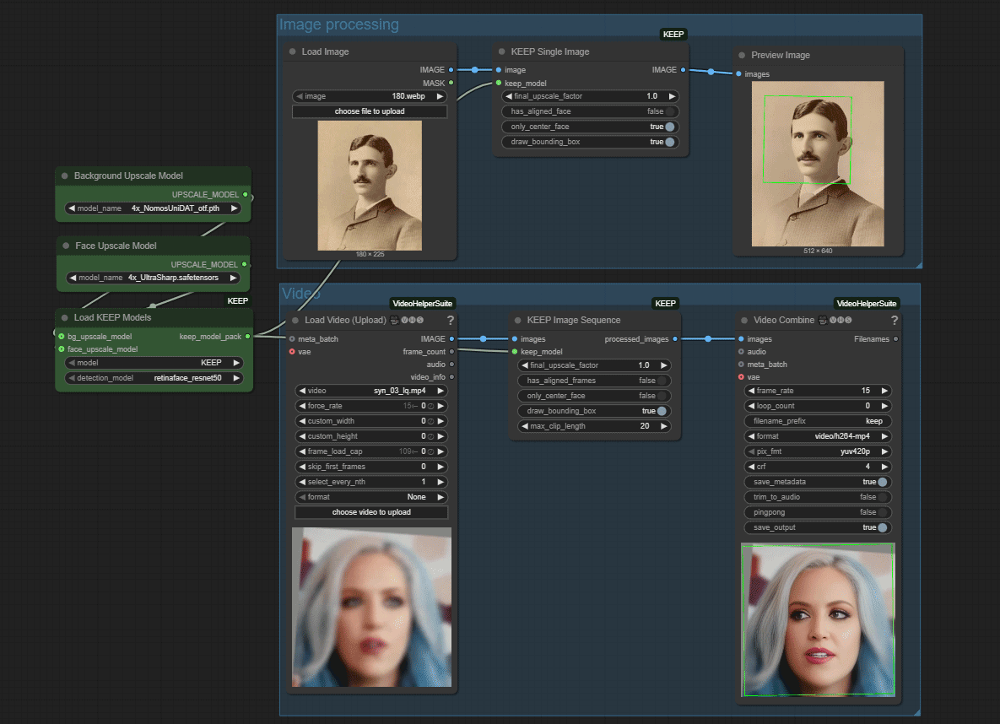

<div align="center">

<h1>ComfyUI-KEEP</h1>
Kalman-Inspired Feature Propagation for Video Face Super-Resolution in ComfyUI

<p align="center">
  
</p>
    
</div>


# Update
- **2025-07-03**: 
	*   Standard ComfyUI `Upscale Model` inputs instead of a hardcoded Real-ESRGAN
	*   Added `final_upscale_factor` for precise output scaling.
- **2025-05-20**: Initial commit

## About ComfyUI-KEEP
This repository provides custom nodes for ComfyUI that implement the **KEEP** algorithm for face super-resolution. KEEP is designed for robust video face super-resolution, and these nodes adapt its capabilities for use within the ComfyUI framework.

You can enhance faces in:
*   Single images
*   Sequences of images (video frames)

The nodes leverage the core architecture and pre-trained models from the <a href="https://github.com/jnjaby/KEEP">original KEEP project</a>.

## Features

*   **High-Quality Face Restoration:** Utilizes the core KEEP model for detailed face enhancement.
*   **Flexible Upscaling Integration:**
    *   Connect **any** ComfyUI-compatible upscale model (from `Upscale Model Loader`) for both background and face upscaling.
    *   Use different models for background and face enhancement within the same workflow.
    *   Full control over the final output size with a `final_upscale_factor`.
*   **Single Image & Sequence Processing:** Enhance faces in individual images or entire video frame sequences.
*   **Choice of Detection Models:** Supports various face detection backbones (RetinaFace, YOLOv5).


## Nodes
This package includes the following custom nodes:

### 1. Load KEEP Models
   Loads the core KEEP model and face detection models. It now accepts `UPSCALE_MODEL` inputs, allowing you to connect any upscaler loaded via a standard `Upscale Model Loader`.

-   **`model`**: Choose between "KEEP" (general) or "Asian".
-   **`detection_model`**: Face detection model to use (e.g., `retinaface_resnet50`).
-   **`bg_upscale_model` (optional)**: Connect an `UPSCALE_MODEL` here to enhance the background.
-   **`face_upscale_model` (optional)**: Connect an `UPSCALE_MODEL` here to further enhance the quality of the restored face patch.

### 2. KEEP Single Image
   Restores and enhances faces in a single input image.

-   **`image`**: The input image.
-   **`keep_model`**: The model pack from the `Load KEEP Models` node.
-   **`final_upscale_factor`**: The final scaling factor for the output image. For example, if your BG upscale model is 4x but you only want a 2x final output, set this to `2.0`. If you want the original size, set this to `1.0`.
-   **`has_aligned_face`**: Set to `True` if the input is an already aligned 512x512 face.
-   **`only_center_face`**: If multiple faces are detected, process only the one closest to the center.
-   **`draw_bounding_box`**: Draws a box around the detected face.

### 3. KEEP Image Sequence
   Restores and enhances faces in a sequence of input images (e.g., frames from a video).

-   **`images`**: A batch of images representing video frames.
-   **`keep_model`**: The model pack from the `Load KEEP Models` node.
-   **`final_upscale_factor`**: The final scaling factor for the output frames.
-   **`max_clip_length`**: Maximum number of frames to process in one go by the KEEP network (for VRAM management).

## Installation

1.  **Clone this repository:**
    ```bash
    git clone https://github.com/wildminder/ComfyUI-KEEP.git
    ```
    Place it into your `ComfyUI/custom_nodes/` directory.

2.  **Install Dependencies:**
    The core KEEP model has several dependencies
    ```bash
    cd ComfyUI/custom_nodes/ComfyUI-KEEP
    pip install -r requirements.txt
    ```

3.  **Download Pre-trained Models:**
    The nodes will attempt to download the required models automatically during the first run. Models will be saved into standard ComfyUI model directories:
    *   **KEEP models** (`KEEP-b76feb75.pth`): `ComfyUI/models/keep_models/KEEP/`
    *   **Face detection/parsing models** (e.g., `detection_Resnet50_Final.pth`): `ComfyUI/models/facedetection/`
    *   **Upscale Models**: Place any upscaler models (like Real-ESRGAN, SwinIR, etc.) in `ComfyUI/models/upscale_models/`.

    If automatic download fails for the KEEP or face models, you can manually download them from the original [KEEP Releases V1.0.0](https://github.com/jnjaby/KEEP/releases/tag/v1.0.0) and place them in the corresponding ComfyUI subdirectories mentioned above.

4.  **Restart ComfyUI.**

## Citation for Original KEEP

If you use the core KEEP algorithm or models in your research, please cite the original paper:

```bibtex
@InProceedings{feng2024keep,
      title     = {Kalman-Inspired FEaturE Propagation for Video Face Super-Resolution},
      author    = {Feng, Ruicheng and Li, Chongyi and Loy, Chen Change},
      booktitle = {European Conference on Computer Vision (ECCV)},
      year      = {2024}
}
```