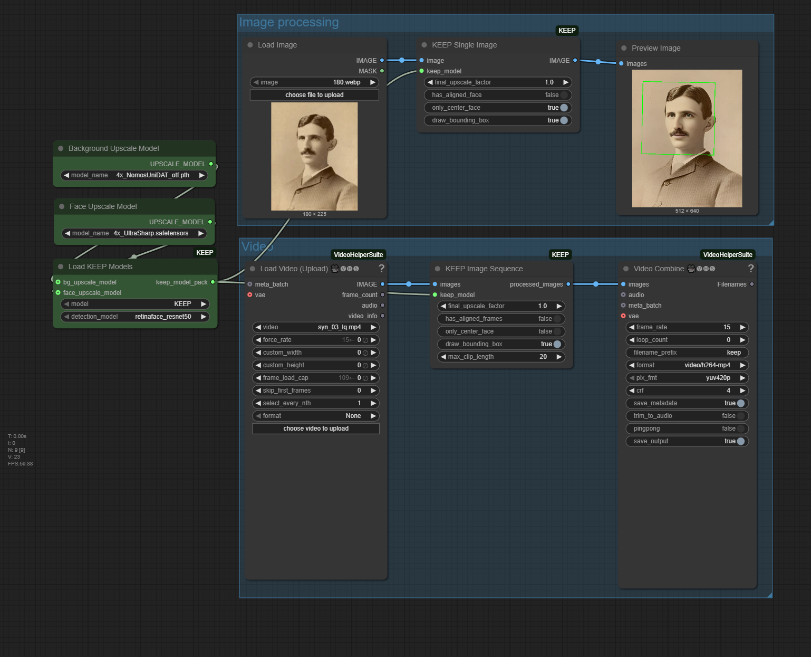

<div align="center">

<h1>ComfyUI-KEEP: Kalman-Inspired Feature Propagation for Video Face Super-Resolution in ComfyUI</h1>

<p align="center">
  
</p>
    
</div>


# Update
- **2025-05-20**: Initial commit

## About ComfyUI-KEEP
This repository provides custom nodes for ComfyUI that implement the **KEEP** algorithm for face super-resolution. KEEP is designed for robust video face super-resolution, and these nodes adapt its capabilities for use within the ComfyUI framework.

You can enhance faces in:
*   Single images
*   Sequences of images (video frames)

The nodes leverage the core architecture and pre-trained models from the <a href="https://github.com/jnjaby/KEEP">original KEEP project</a>

## Features

*   **High-Quality Face Restoration:** Utilizes the KEEP model for detailed face enhancement.
*   **Single Image Face Upscaling:** Process individual images to restore and enhance faces.
*   **Video Frame Sequence Processing:** Enhance faces frame-by-frame in a video sequence, leveraging temporal information where applicable by the KEEP model.
*   **Flexible Upscaling Options:**
    *   Optional background upscaling using Real-ESRGAN.
    *   Optional further upscaling of the restored face patch using Real-ESRGAN.
*   **Choice of Detection Models:** Supports various face detection backbones (RetinaFace, YOLOv5).
*   **Two Pre-trained KEEP Models:**
    *   `KEEP`: General purpose model.
    *   `Asian`: Model potentially fine-tuned for faces with Asian features.

## Nodes
This package includes the following custom nodes:

### 1. Load KEEP Models
   Loads the KEEP model, face detection models, and optional upscalers into memory.

- model_type: Choose between "KEEP" (general) or "Asian".
- detection_model: Face detection model to use.
    - Supports: retinaface_resnet50, retinaface_mobile0.25, YOLOv5l, YOLOv5n.
- use_bg_upsampler: Whether to enable background upscaling with Real-ESRGAN.
- use_face_upsampler: Whether to enable further upscaling of the restored face patch with Real-ESRGAN.
- bg_tile_size: Tile size for Real-ESRGAN if used (for memory management).

### 2. KEEP Face Upscale (Single Image)
   Restores and enhances faces in a single input image.

**Inputs:**
- image: The input image.
- keep_model_pack: Output from the Load KEEP Models node.
- has_aligned_face: Set to True if the input image is already a 512x512 cropped and aligned face. If False, face detection and alignment will be performed.
- only_center_face: If multiple faces are detected, process only the face closest to the center
- draw_bounding_box: Draw a bounding box around the detected face on the output image
- background_upscale_factor: The factor by which to upscale the background.


**Outputs:**
IMAGE: The processed image with the face(s) restored.


### 3. KEEP Process Image Sequence (Video Frames)
   Restores and enhances faces in a sequence of input images (e.g., frames from a video).

**Inputs:**
- images: A batch of images representing video frames.
- max_clip_length: Maximum number of frames to process in one go by the KEEP network (due to GPU memory constraints)


**Outputs:**
- processed_images: The batch of processed frames with faces restored.

## Installation
Via Manager or by cloning repo:

1.  **Clone this repository:**
    ```bash
    git clone https://github.com/wildminder/ComfyUI-KEEP.git
    ```
    Place it into your `ComfyUI/custom_nodes/` directory.

2.  **Install Dependencies:**
    The core KEEP model has several dependencies. The vendored `basicsr` and `facelib` libraries are included in the `modules/deps/` folder of this custom node.
    You still need to ensure the Python environment for ComfyUI has the necessary packages:
    ```bash
    cd ComfyUI/custom_nodes/ComfyUI-KEEP
    pip install -r requirements.txt
    ```
    Key requirements include:
    *   `Pytorch >= 1.7.1` (usually satisfied by ComfyUI)
    *   `opencv-python`
    *   `scipy`
    *   `numpy`
    *   `ffmpeg-python` (for video processing via `basicsr.utils.video_util` if not using external video loading nodes)


3.  **Download Pre-trained Models:**
    The nodes will attempt to download the required models automatically during the first run of the `Load KEEP Models` node. Models will be saved into standard ComfyUI model directories:
    *   KEEP models (`KEEP-b76feb75.pth`, `KEEP_Asian-4765ebe0.pth`): `ComfyUI/models/keep_models/KEEP/`
    *   Real-ESRGAN model (`RealESRGAN_x2plus.pth`): `ComfyUI/models/upscale_models/`
    *   Face detection/parsing models (e.g., `detection_Resnet50_Final.pth`): `ComfyUI/models/facedetection/`

    If automatic download fails, you can manually download them from the original [KEEP Releases V1.0.0](https://github.com/jnjaby/KEEP/releases/tag/v1.0.0) and place them in the corresponding ComfyUI model subdirectories mentioned above.

4.  **Restart ComfyUI.**

## Citation for Original KEEP

If you use the core KEEP algorithm or models in your research, please cite the original paper:

```bibtex
@InProceedings{feng2024keep,
      title     = {Kalman-Inspired FEaturE Propagation for Video Face Super-Resolution},
      author    = {Feng, Ruicheng and Li, Chongyi and Loy, Chen Change},
      booktitle = {European Conference on Computer Vision (ECCV)},
      year      = {2024}
}
